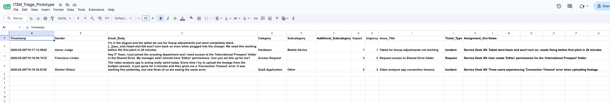

# IT Service Automation Portfolio

This repo contains three automation tools I built at MLB to fix operational problems I kept running into — manual ticket triage, guesswork-based staffing, and a knowledge base that is too time-consuming to maintain.

---

## Project 1: Workforce Capacity & Demand Planner

**Folder:** `/capacity-demand-planner`

### The problem

Staffing decisions were being made based on gut feel and manual Excel pulls. Nobody had a clear picture of how ticket volume, travel schedules, and team availability overlapped on any given week.

### What I built

A forecasting tool that pulls live data from a PostgreSQL database, runs capacity calculations through a Python Flask API, and surfaces the results in a Streamlit dashboard with an AI-generated plain-English summary for ops leadership.

The dashboard includes a demand multiplier slider so leadership can simulate what happens if ticket volume spikes 30% without touching the underlying data.

### Architecture

Streamlit triggers a Make.com webhook, which pulls live data from Supabase, sends it to a Flask API for computation, and returns a forecast with an AI summary in real time.

---

## Project 2: Ticket Triage & Routing Engine

**Folder:** `/ticket-triage-routing-engine`

### The problem

Support requests came in through multiple channels as unstructured text. Someone had to manually read each one, classify it, and route it to the right queue. It didn't scale.

### What I built

A Make.com workflow that receives incoming tickets via webhook, passes them to GPT-4o mini with a custom ITSM classification prompt, parses the structured JSON output, and logs the result to a staging database mapped to our ServiceNow schema.

### Architecture

### Sample output

---

## Project 3: Knowledge Base Auditor & Auto-Generator

**Folder:** `/knowledge_base_auditor`

### The problem

The knowledge base was full of duplicates and gaps. Agents either didn't have time to write new articles or wrote ones that already existed. Coverage was inconsistent and getting worse over time.

### What I built

A two-stage Make.com workflow. The first stage checks whether a KB article already exists for a resolved ticket by querying a PostgreSQL index. If one exists, the workflow stops. If not, the second stage drafts a new article using GPT and logs it back to the database so future runs won't create duplicates.

### Architecture

---

## Database schemas

The KB auditor and triage engine rely on a few PostgreSQL tables for state management and logging. Schemas are in each project's `/sql` folder.

---

## Stack

Python, PostgreSQL, Supabase, Flask, Streamlit, Make.com, OpenAI API, Webhooks, Google Sheets, PythonAnywhere
