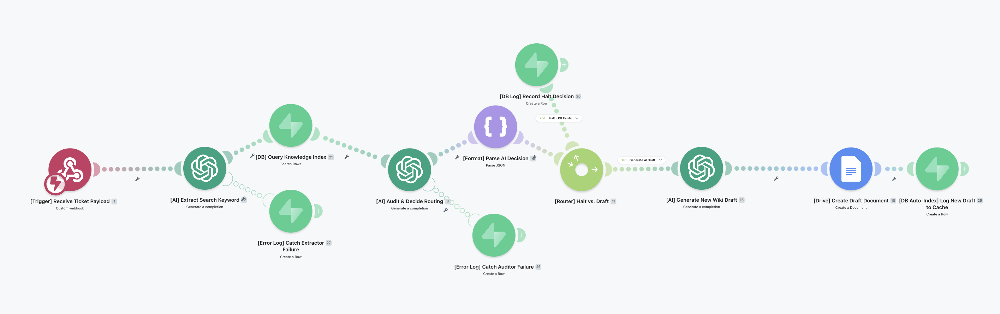

# Enterprise IT Service Automation Portfolio

This repository contains two event-driven AI workflow systems for IT service operations.

Designed and built these systems to reduce manual dispatching and repetitive documentation workflows through stateful AI orchestration and event-driven automation.


---

## Project 1: Omni-Channel Ticket Triage Engine

**Folder:** `/omnichannel_triage_engine`

### The Problem

Support requests arrive unstructured from multiple inbound channels (inbound emails, Zoom Contact Center inbound calls, Slack messages, etc.), requiring human analysts to read, classify, and manually triage and generate every single ticket.

### The Architecture & Solution

* **Normalized Ingestion:** Built a webhook-driven ingestion system to catch unstructured inbound support events.
* **AI Classification:** Leveraged OpenAI (GPT-4o) with a custom system prompt to analyze the payload, classify the issue type (INC or REQ), and map it to the organization's internal taxonomy.
* **Deterministic Formatting:** Utilized strict JSON parsing layers to enforce deterministic outputs, ensuring the payload is properly structured for downstream routing.
* **Observability:** Logged all classification outcomes into a mock staging database (Google Sheets) designed to map 1:1 with ServiceNow schemas.

### Visual Architecture
*(Note: Ensure your uploaded image in the assets folder matches this file name exactly!)*


### The Impact

* **Eliminated ~8-9 hours of manual ticket triage per week.**
* Achieved instantaneous, zero-touch ticket routing to the correct resolution queues.

---

## Project 2: Self-Healing Knowledge Base Auditor

**Folder:** `/knowledge_base_auditor`

### The Problem

When a large Knowledge Base (KB) grows outdated, support analysts spend many hours manually drafting net-new, updating existing, or revising/deprecating outdated KB articles.

### The Architecture & Solution

* **Programmatic Knowledge Retrieval:** Transitioned the team from slow, manual Confluence searches to an automated, high-speed PostgreSQL (Supabase) index. This custom database layer programmatically caches existing KB metadata, allowing the AI to instantly query prior resolutions before taking action.
* **Two-Tier AI Routing:**
  * **Tier 1 (The Auditor):** Extracts keywords from inbound ticket resolutions, queries the database, and deterministically decides if a duplicate KB exists. If it does, the workflow halts.
  * **Tier 2 (The Drafter):** If no KB exists, the AI autonomously drafts a new, formatted Wiki in Google Docs.
* **The "Self-Healing" Loop:** Automatically indexes newly generated AI drafts back into the PostgreSQL database, ensuring the system learns and blocks duplicates in real-time.
* **Reliability & Error Handling:** Built comprehensive Try/Catch error-handler routes around volatile OpenAI endpoints, reducing workflow interruptions caused by API failures.

### Visual Architecture
*(Note: Ensure your uploaded image in the assets folder matches this file name exactly!)*


### Business Impact

* **Eliminated an estimated 20-30 hours of manual documentation toil per month.**
* Ensured 100% documentation coverage for new issues while preventing duplicate work.

---

## Database Schemas (Supabase / PostgreSQL)

This architecture relies on persistent state management to track execution logic, halt redundant workflows, and log API failures. Below are the core table schemas powering the observability layer.

### 1. Execution Logs (Audit Trail)

Tracks every decision made by the Tier 1 AI Auditor, providing a clear ROI metric on redundant drafts prevented.

```sql
CREATE TABLE execution_logs (
  id uuid DEFAULT gen_random_uuid() PRIMARY KEY,
  ticket_id VARCHAR(255),
  status VARCHAR(255),
  ai_verdict TEXT,
  created_at TIMESTAMP WITH TIME ZONE DEFAULT timezone('utc'::text, now())
);
