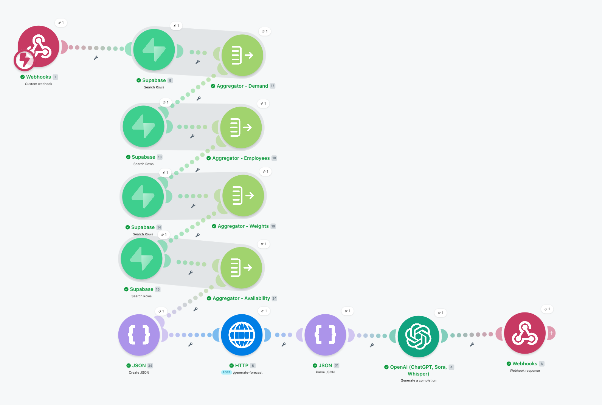
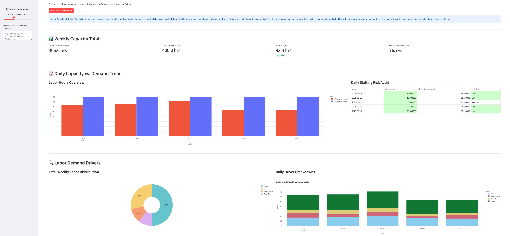
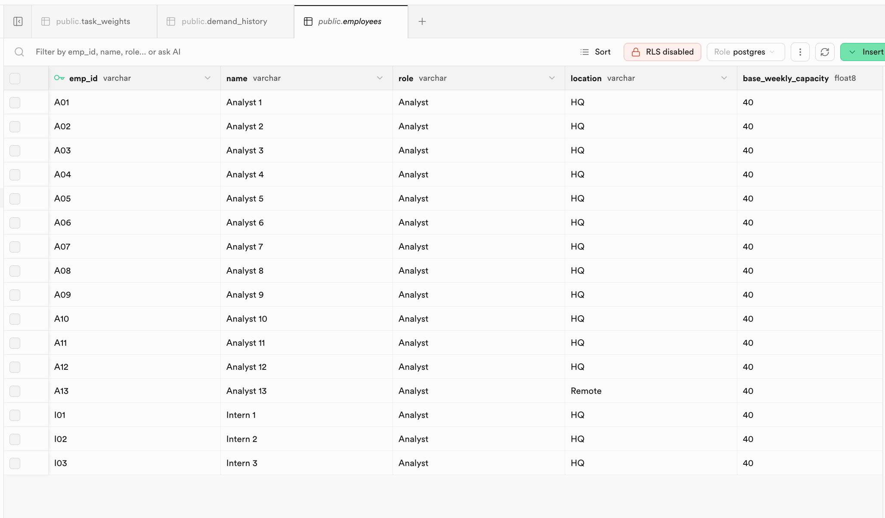
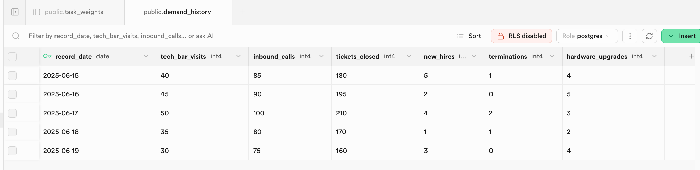
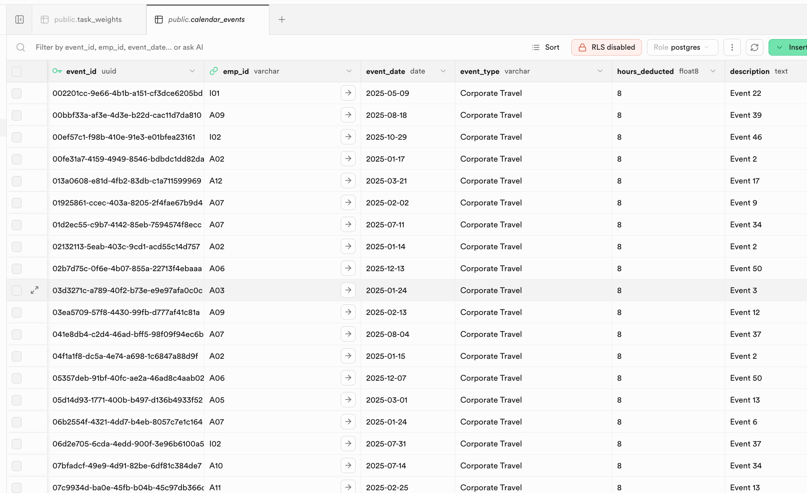
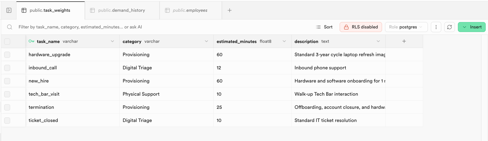

# Workforce Capacity & Demand Planner

A forecasting tool that replaced a manual weekly Excel process with a live dashboard ops leadership can actually use. It pulls staffing, ticket volume, and travel data from a PostgreSQL database, runs capacity calculations through a Python API, and surfaces the results with an AI-generated plain-English summary.

---

## How it works

1. **Streamlit frontend** (`app.py`): the user hits Generate, which sends a JSON payload with a demand multiplier to a Make.com webhook
2. **Make.com**: triggers a scenario that pulls four tables from Supabase (employees, demand history, task weights, calendar events), bundles them into a single JSON object, and POSTs it to the Flask API
3. **Flask API** (`flask_app.py`): receives the data, calculates baseline capacity, deducts for overlapping travel and PTO, multiplies demand history by task weights, and returns a forecast with a weekly summary
4. **Streamlit frontend**: receives the results and renders interactive charts and tables using Plotly and Pandas

The dashboard includes a demand multiplier slider so leadership can simulate what happens if ticket volume spikes without touching the underlying data.

---

## Architecture

---

## Dashboard

---

## Database schemas

The system pulls from four Supabase tables:

---

## What's in this repo

- `app.py`: Streamlit frontend, handles UI and the initial webhook call to Make.com
- `flask_app.py`: Flask API, contains all the forecasting logic and math
- `capacity_demand_planner_blueprint.json`: the Make.com blueprint, import directly into a Make.com workspace to replicate the scenario
- `requirements.txt`: Python dependencies (streamlit, pandas, requests, plotly, flask)
- `/assets`: architecture diagram, dashboard screenshot, database schema screenshots, and Make.com flow canvas

---

## Configuration

To run this locally:

- In `app.py`: replace `make_webhook_url` with your Make.com webhook URL
- In Make.com: configure the scenario with your Supabase credentials and the URL of your deployed Flask API
