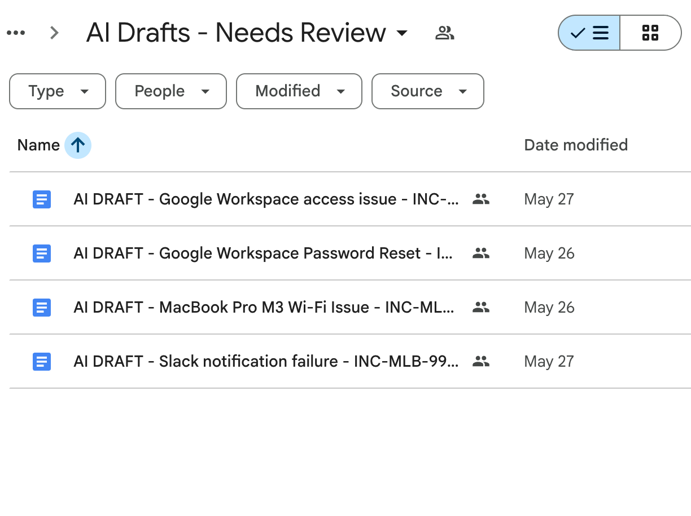
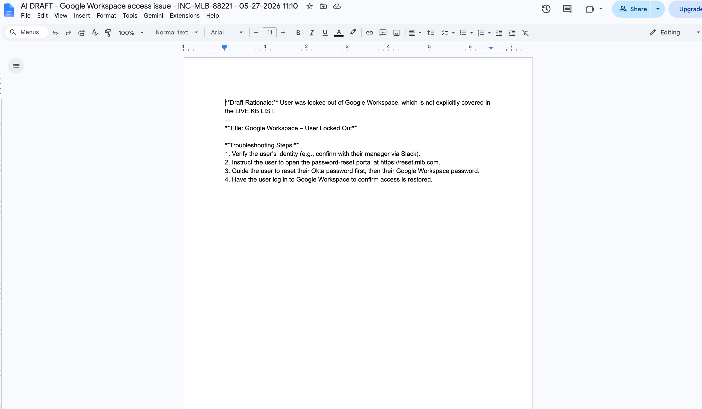
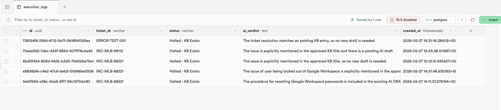
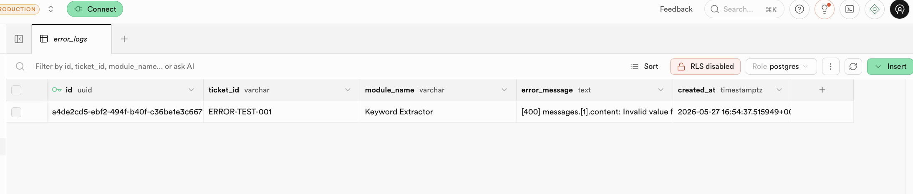
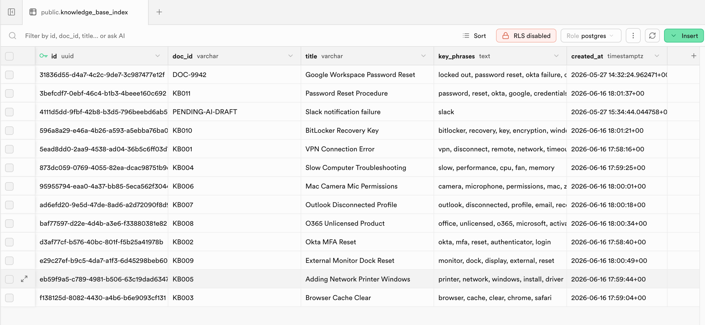

# Knowledge Base Auditor & Auto-Generator

The knowledge base at MLB was full of gaps and duplicates. Agents either didn't have time to write new articles after resolving tickets, or wrote ones that already existed. This tool fixes both problems automatically.

---

## How it works

When a resolved ticket comes in via webhook, the workflow runs in two stages:

1. **Extract keywords**: GPT reads the resolution notes and pulls out search terms
2. **Query the KB index**: those terms get checked against a PostgreSQL database of existing articles
3. **Route the decision**: if a match is found, the workflow halts and logs the reason. If no match exists, it moves to stage two
4. **Draft a new article**: GPT generates a structured KB article based on the resolution notes
5. **Create the Google Doc**: the draft gets written to Google Drive with a standardized title and format
6. **Index the new draft**: the new article gets logged back to the PostgreSQL index so future runs won't create duplicates

Error handling is built in at the extraction and auditing steps — API failures get caught and logged without breaking the workflow.

---

## Sample output

### AI-generated drafts

---

## Execution logs

The system logs every decision the auditor makes, including the reasoning behind each halt.

---

## Error logs

API failures get caught and logged with the module name and error message for debugging.

---

## Knowledge base index

The PostgreSQL index tracks all existing and pending KB articles by title and key phrases.

---

## What's in this repo

- `KB_Auditor_Engine.blueprint.json`: the Make.com blueprint. Import directly into a Make.com workspace to replicate the full workflow
- `/assets`: workflow canvas, draft folder, sample draft, execution logs, error logs, and KB index screenshots
- `/examples`: sample input payload and AI decision output for reference

## How to import the blueprint

1. Download `KB_Auditor_Engine.blueprint.json`
2. Create a new scenario in [Make.com](https://www.make.com/)
3. Click the `...` menu and select **Import Blueprint**
4. Map your own Supabase, OpenAI, and Google Drive connections to the relevant modules
