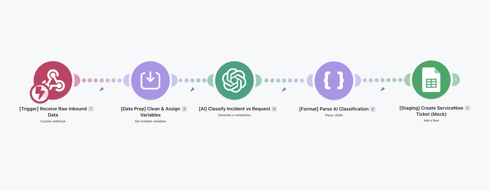

# Ticket Triage & Routing Engine

## What this does

Incoming support tickets used to get manually sorted and routed, which didn't scale. This system automates that process. When a ticket comes in via webhook, it gets passed to GPT-4o mini, which classifies it by issue type, category, and urgency using a custom ITSM taxonomy, then logs the result to a staging database for downstream ServiceNow integration.

## How it works

1. **Receive Raw Inbound Data**: a custom webhook fires when a new ticket comes in, passing the raw payload and sender info into the scenario
2. **Clean & Assign Variables**: incoming data gets normalized and assigned to variables for use downstream
3. **Classify Incident vs Request**: GPT-4o mini reads the payload and maps it against the MLB ITSM taxonomy, returning a structured JSON object with ticket type, category, subcategory, impact score, urgency score, and a short title
4. **Parse AI Classification**: the JSON string from GPT gets parsed into discrete fields
5. **Create ServiceNow Ticket (Mock)**: classified fields get written to a staging Google Sheet, simulating the ServiceNow ticket creation step

## What's in this repo

- `Triage_Engine_v1.blueprint.json`: the Make.com blueprint. Import this directly into a Make.com workspace to replicate the full workflow
- `/assets`: workflow canvas screenshot and staging database logs

## How to import the blueprint

1. Download `Triage_Engine_v1.blueprint.json`
2. Create a new scenario in [Make.com](https://www.make.com/)
3. Click the `...` menu at the bottom and select **Import Blueprint**
